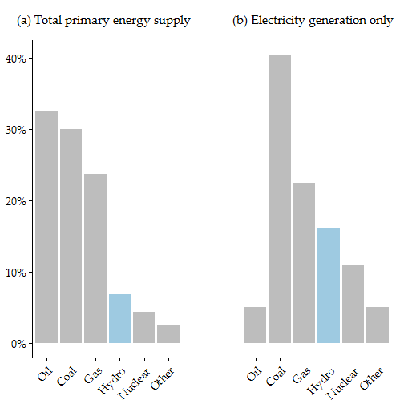

## Highlights

- Give you a flavour of Bayesian thinking.
- Go through some simple examples (including code) of how to do this in *R*.

## Would you jump off a bridge if your friends did?

 

Source: https://xkcd.com/1170/

# Introduction

## Test figure {.flexbox .vcenter .smaller}

 

Source: BP (2015) and IEA (2014)
